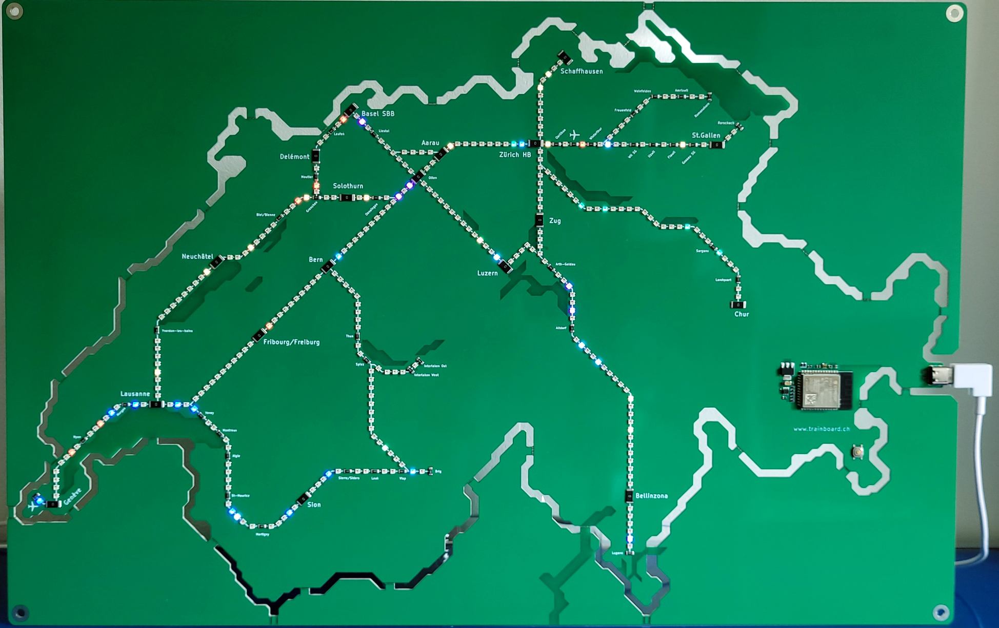

# Trainboard

## About

Your window on the Swiss Rail Network in Real Time! 

Dive into the heart of Switzerland's incomparable rail network with our latest innovation: the Train Board. This state-of-the-art printed circuit board (PCB) is designed to provide you with a real-time overview of the Swiss rail network’s mainline trains thanks to more than 300 LEDs. 

### Modes

The Train Board offers three distinct modes, each providing a unique perspective on the Swiss train network. 

-   **Normal Mode**, the board displays real-time train information, keeping you updated with current movements across the network. 
-   **Rewind Mode** allows users to step back in time and review the last 45 minutes of train activity, offering a historical view of the network's operations. 
-   **Delay Mode** focuses on providing an overview of train delays, giving the users a great overview of the current situation on the Swiss train network. 

These modes enhance the board's functionality, giving it both artistic depth and practical utility.

## Installation

### Code

##### Download
Using the green `<> Code`  button, download the repository as a .zip file, unzip it and copy it to a location of your choice.

##### Checkout

    git clone https://www.github.com/edautomation/TrainboardFirmware.git <your preferred location>/TrainboardFirmware

    git submodule update --init --recursive

### IDE
This project uses [PlatformIO](https://platformio.org/). Follow instructions [here](https://platformio.org/install/ide?install=vscode) to install it.

## Usage

Start by verifying that your setup works: follow instructions from the [PlatformIO documentation](https://docs.platformio.org/en/latest/tutorials/espressif32/arduino_debugging_unit_testing.html#tutorial-espressif32-arduino-debugging-unit-testing). If you do not have the ESP32-DevKitC, use the Trainboard instead.

Once your setup works, open the Trainboard project in a new VSCode window.
- Select the PlatformIO extension (ant icon) in the Activity Bar
- PROJECT TASKS > trainboard > General and hit `Build`
- On successful compilation, hit `Upload and Monitor`

## Next Steps

In the coming months, you can expect the following:

- [ ] Port project to ESP-IDF v5.x
- [ ] Minimal secure boot (only signing of images)

## Contributing

We welcome any contribution wholeheartedly. 

Please note, however, that we are working on this project on our spare time. We therefore cannot guarantee to respond to/analyze/review your contribution in a timely manner. Security issues will have the highest priority and we will try to fix them as rapidly as possible.

To find out more about how to contribute, please check [CONTRIBUTING.md](CONTRIBUTING.md).

## Documentation

You can find it in the [doc](doc/) folder. 

- [Architecture](doc/ArchitectureAndDesign.pdf) : general description of the software and how it is constructed. Based on the [Arc42 template](https://arc42.org/overview)
- [Security Concept](doc/SecurityConcept.pdf) : assessment of the security risks and documentation of action items
- [Diagrams](doc/SoftwareArchitecture.drawio) : contains state machine diagrams, class diagrams, etc.

## License

The project is licensed under the [GPLv3](https://www.gnu.org/licenses/gpl-3.0.en.html) license. See [LICENSE](LICENSE).

## Contact Information

For any communication other than
- Security issue report
- Bug report
- Feature request

please visit our [web page](https://www.trainboard.ch).

## Acknowledgements

Thanks to the community for providing easy-to-use and powerful libraries such as
- [Embedded template library](https://github.com/ETLCPP/etl) (Also great in a professional environment)
- [FastLED](https://github.com/FastLED/FastLED)
- [WiFiManager](https://github.com/tzapu/WiFiManager)
- [Adafruit_LTR329_LTR303](https://github.com/adafruit/Adafruit_LTR329_LTR303)
- [Fake Function Framework](https://github.com/meekrosoft/fff)

They really speed-up development time. Without them, we would not be able to create such a project in our spare time.

